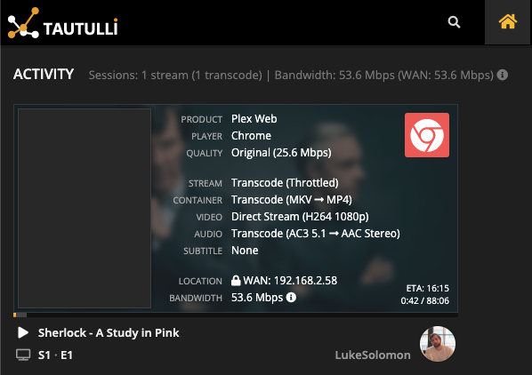
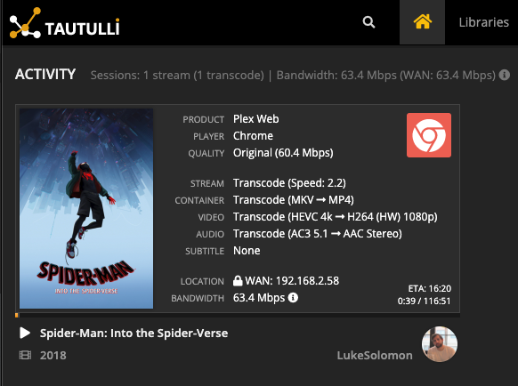

# Welcome to Plex!

If you're here, you've either been invited to Luke's Plex server, or you're curious about how to get started. Either way, lucky you!

If you're here for Movies, music, or TV Shows, you're in the right place. If you want books or Audiobooks, just scroll down to that section.

## Plex and you

**What the heck is Plex?**

**Plex** is a media streaming app that lets you listen to music and watch movies & TV shows directly from a server that I store content on. It's available on almost literally every device - phones, computers, web browsers, smart TVs, Fire TV Sticks, Roku - I mean everything. It also has the capacity to stream *anything* that you might want to watch, and the best part? It's free.

**So why were you so insane about getting me to use it?** 

Well, This whole thing is really just a passion project of mine to help me learn more about how networks and servers interconnect with one another. It's been incredibly fun, and the system is finally at a point where I want more of my friends to take advantage of it - otherwise I'm just watching it alone, and that's no fun. Plus, the more of you that use it, the more I can justify buying expensive server hardware to play with.

**Do I have to pay for anything?**

Nope. If you feel obliged, I'll accept donations in the form of [hard drives](https://www.amazon.com/dp/B07D5V2ZXD/ref=cm_sw_em_r_mt_dp_U_fLivDb3A7CGEZ).

**What's the catch?**

The catch is that I'm not very good at any of this, and the server may go down from time to time, or I may be working on it. It's also pretty buggy, but I'm ironing them out slowly. 

## The Basics

**I don't know what I'm doing. Where to I start?**

1. If you haven't already, make an account at plex.tv (I highly recommend using the 'Sign in with Google/Facebook option so you don't tell me you forgot your password in a week')
2. Send a text/email/facebook message to me with whatever email that you used to sign up
3. Wait for an email from Plex that says something along the lines of "some fantastic person shared their media with you!"
4. Accept the invitation, and you're almost ready to go!

**I want to watch something. Help.**

1. Start by downloading the Plex app on whatever device you use, or just go to app.plex.tv if you're on your computer.
2. Sign in with the account you used above (if you lost this login or need to make a new account, go ahead and make one, and let me know)
3. You're in. 

**Do I need to buy Plex Pass?**

NO. You can if you want to, the biggest advantage is that it lets you use Plex on any device for free (see below), and it allows you to save content offline. 

**I downloaded the iPhone/android app, but now it wants me to pay?**

Yeah, it's a bummer. This is Plex's monetization strategy - they charge for the mobile app. Frankly, $5 for a one time purchase isn't a huge deal for me, but I bought plex pass anyway. If you're planning to use it at home, don't worry - this is the only platform they charge for.

## What the frick is 1080ti? Final Tower? These things are scaring me...

I technically have two servers set up in case one fails. 

- "Final Tower" is configured to run 24/7 and sits in my closet, and won't randomly be turned off by a drunk friend who thinks the RGB LEDs are too bright. 
- "1080ti" is my backup, feel free to use it if you are having any issues with Final Tower, but please text me so that I know there is an issue that I need to look into.

## Direct Play

This is a long, complex topic - so I'll start with what I need from you, and afterwards get into the complicated nerdy shit.

**TL;DR:** *Try to prevent my server from having to transcode video. When playing video, set in the options to play 'original quality'*

##### How To Change Your Settings: (the rest of this section is coming soon)
- [Android](https://github.com/moe-m/plex-docs/tree/master/settings/android)
- [Apple TV](https://youtu.be/6itri_ZiJd8)

##### complicated nerdy shit:
Most of the content on my server is extremely high bitrate Blu-Ray quality video - what this means for you is that anything you watch on Plex will look gorgeous on that 4k TV of yours. What it also means is that you might need to make some changes to ensure that it works at that level of quality. Keep in mind, there's a few links in the chain that may break:

1. My internet upload speed
2. The number of other people streaming
3. Your internet download speed
4. Your connection from your home router to your device (for 4k, I highly recommend hard-wiring your device)
5. Whether your device supports HEVC, also known as x265. You can easily check this online.

Getting a Direct Play/Stream is really the only way to ensure that you're going to have a good time.

## Requests

So you want to watch something I don't have? Awesome! I've set up a system so you don't even have to get in touch with me.

**[https://requests.welcometothefucking.show](https://requests.welcometothefucking.show)**

- If you're typing this URL in, make sure that you include the https! I don't know how to configure the redirect from http yet.
- Logging in is a nightmare because this site SUCKS. The process looks like this:
	1. Click "Sign in with plex" which opens a popup.
	2. On the popup, log in (however you normally log in to plex)
	3. Once the popup says "you may now close this popup," do so
	4. Wait. For like, 30 seconds, sometimes. (Look, I know. It's a shit app. There's no alternative, which is why I'm making one.)
	5. You're now in ombi. Enjoy!

## Checking watch Statistics & monitoring Stream health

Want to see if you're direct streaming/playing a video, or want to see how much you've watched? Head to this URL:

**[https://requests.welcometothefucking.show](https://requests.welcometothefucking.show)**

- This app works WAY better than ombi does, so you shouldn't run into any issues logging in.
- Stats are only recorded on things played from 'Final Tower', 1080ti views are not.

This is how a Direct Stream should look when you log in:

A Transcode will look like this:

Confused? Don't worry. Just look at the Video line, that's all you need to worry about.

## FAQ

**Why is the server down???**

It could be any number of reasons - either I'm changing something, doing maintenance, or there was a power outage. I'm working on building a web page that will let you know.

**Why are you missing an episode of a show?**

This happens usually because a file is misnamed. Just text me and I'll fix it.

**Why can't I stream ____? It's saying your server isn't powerful enough.**

This is a tricky bug to track down - try setting your device to play original quality. If that doesn't work, text me and I'll find a fix.

**Why is the stream lagging? It's pausing the video every 15 seconds.**

It's probably your internet connection. Try setting the device to play a lower quality.

**Why is the video screwed up?**

This is usually an issue with my video files, and will require me to fix them manually, so text me.

# Music

My server hosts a very small collection of FLAC audio files, so if you have a high quality audio system, you can request music on ombi to listen to.

# BOOKS & Audiobooks

Guess what? I also host Books & Audiobooks!

https://books.welcometothefucking.show

https://audiobooks.welcometothefucking.show/booksonic

I have to make individual accounts for you, so message me for details.

Requests have to be handled manually, so let me know if there's anything you want.
